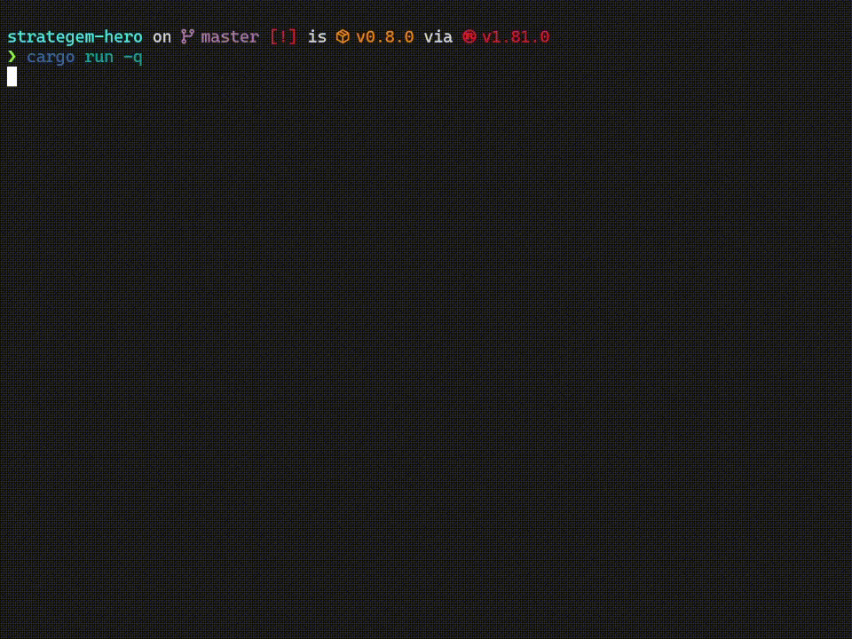

# Strategem Hero - CLI Game

This is simple cli game written in Rust, copying (actually just loosely following) Strategem Hero mini-game in Helldivers 2 that available with deluxe edition of the game.



## Main features

- Includes all in-game strategems as of June 8th (63 total)
- Chain of successfull strategem inputs gives a multiplier to the score
- Strategems are divided into three different levels:
  - Easy - up to 3 inputs
  - Medium - from 4 to 6 inputs
  - Hard - from 7 and above inputs
- Each level of strategems gives different score
- Tracking of best score between launches

## How to play

You can install this game via `cargo install strategem-hero` command or download precompiled binary included in latest release (for Windows only).

Alternatively you can build this game from source, following next steps:

```sh
# clone repo from Github
git clone https://github.com/Milinkov-N/strategem-hero.git

# Go to the project directory
cd strategem-hero

# run the game in release mode
cargo run --release

# or run this command if you just need to build the binary
cargo build --release
```
